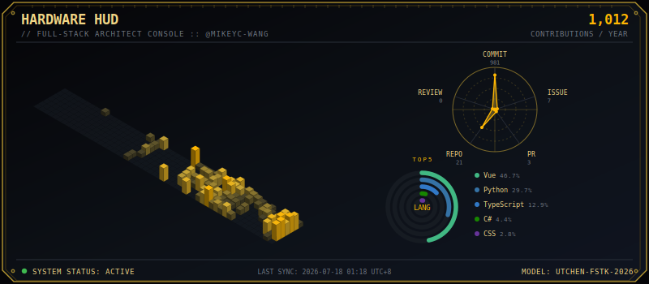

<div align="center">

# ⚡ HardwareHUD

### 全端架構師的黑金晶片控制台

一個完全手工繪製 SVG、零第三方繪圖庫的 GitHub Profile 動態數據面板



**Language：** [繁體中文](README.md) ・ [English](README.en.md) ・ [日本語](README.ja.md) ・ [한국어](README.ko.md)

[](LICENSE)

</div>

---

## 專案簡介

**HardwareHUD** 會透過 GitHub GraphQL API v4 撈取你過去一年的 Contribution 日曆與前五大程式語言佔比，
並純手工用 Python 字串拼接原生 SVG 標籤（`<polygon>`、`<circle>`、`<path>`、`<text>`），
組裝成一張具備黑暗模式（`#0d1117` / `#050508`）搭配鍍金／琥珀金（`#d4af37`、`#ffb703`）霓虹質感的「精密硬體控制台」，
每天由 GitHub Actions 自動重新產生，完全不需要手動維護。

面板由三大核心儀表構成：

| 元件 | 說明 |
| --- | --- |
| 🧊 水平 3D 晶片矩陣 | 52 週 × 7 天的貢獻日曆，以等角投影 (Isometric Projection) 繪製成一整排會發光的立體方塊，Commit 越多方塊越高、顏色越偏發光琥珀金 |
| 📡 聲納雷達掃描儀 | 將 Commit / Issue / PR / Repo / Review 五大維度重新包裝成帶十字瞄準線的科幻五角雷達圖 |
| 💍 同心環形能源條 | 前五大程式語言佔比，改用類似跑車儀表板的多層同心圓弧條呈現 |

## 預覽


> 上圖為 `profile-hud.svg`，由 GitHub Actions 每日自動更新。第一次執行前該檔案不存在，需先手動觸發一次 workflow。

## 使用方式

1. **Fork 或直接使用本專案**，讓 `main` 分支包含 [`src/generate_hud.py`](src/generate_hud.py) 與 [`.github/workflows/hud-updater.yml`](.github/workflows/hud-updater.yml)。
2. **建立 Personal Access Token (PAT)**：前往 GitHub → Settings → Developer settings → Personal access tokens，建立一組具備 `read:user` 權限的 Token（Classic 或 Fine-grained 皆可，只需能讀取你自己的 contributions 與 repositories）。
3. **加入 Repository Secret**：到本專案的 Settings → Secrets and variables → Actions → New repository secret，新增名稱為 `GH_PAT`、值為上一步 Token 的 secret。
4. **設定使用者名稱**：打開 [`.github/workflows/hud-updater.yml`](.github/workflows/hud-updater.yml)，將 `HUD_USERNAME: MikeYC-Wang` 改成你自己的 GitHub 帳號。
5. **手動觸發第一次產生**：到 Actions 分頁選擇 `Hardware HUD Updater` → `Run workflow`，跑完後 repo 根目錄會出現 `profile-hud.svg`。之後每天 UTC 16:00（台灣時間 00:00）會自動重新產生並 commit。
6. **嵌入你的個人 Profile README**：在你的 `<username>/<username>` 個人簡介 repo 中加入：

   ```markdown
   
   ```

## 本地測試

```bash
pip install -r src/requirements.txt
set GH_PAT=你的PersonalAccessToken   # PowerShell 請用: $env:GH_PAT="..."
python src/generate_hud.py
```

執行完成後會在目前目錄下產生 `profile-hud.svg`。

## 客製化

- 顏色、尺寸等常數集中在 [`src/generate_hud.py`](src/generate_hud.py) 檔案最上方（`COLOR_*`、`WIDTH`、`HEIGHT`），可依喜好調整。
- 自動更新時間可修改 [`hud-updater.yml`](.github/workflows/hud-updater.yml) 中的 `cron` 排程。

## 貢獻

歡迎透過 Issue 或 Pull Request 提出建議與改進！

## 授權

本專案採用 MIT 授權，詳見 [LICENSE](LICENSE)。

---

<div align="center">

Made with ⚡ and hand-rolled SVG · MODEL: UTCHEN-FSTK-2026

</div>
